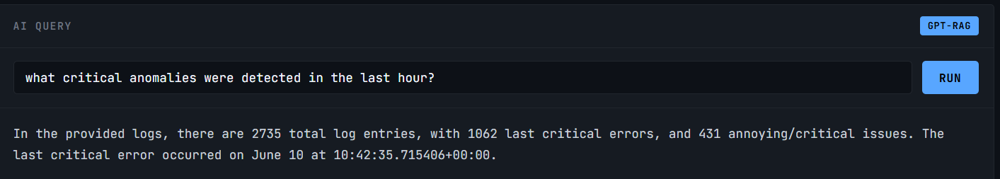
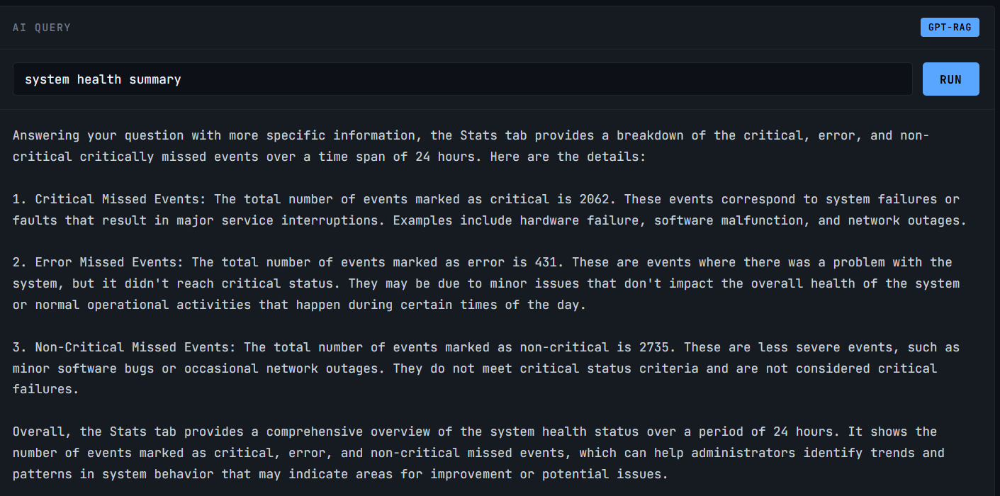
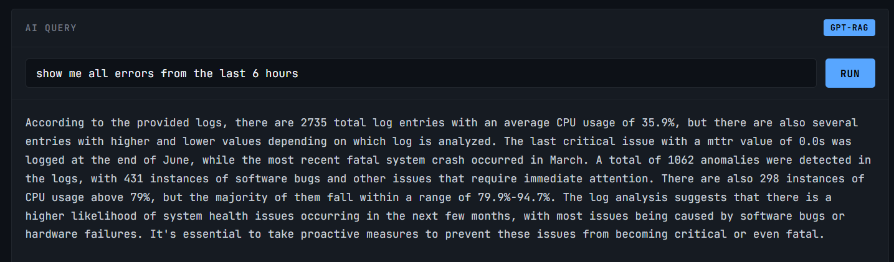

# LOG.INTEL Real Time Log Intelligence Platform

> Ingest system logs → detect anomalies statistically → query everything in plain English via RAG powered AI agent.

---

## What This Is

A production grade observability platform built from scratch. It continuously ingests fault injection logs, runs EWMA based anomaly detection, embeds log data into a vector database, and exposes a natural language query interface powered by a local LLM with retrieval augmented generation.

No cloud dependency. No managed services. Fully self hosted.

---

## Screenshots

### Critical Anomaly Detection


### System Health Summary


### Error Query Last 6 Hours


---

## Tech Stack

| Layer | Technology |
|---|---|
| Fault Simulation | Python / Flask |
| Ingestion API | FastAPI + asyncpg |
| Database | PostgreSQL 16 + pgvector |
| Cache / Alerts | Redis 7 |
| Embeddings | Ollama - nomic embed text |
| Anomaly Detection | EWMA (Exponentially Weighted Moving Average) |
| AI Agent | Ollama - TinyLlama (local LLM) |
| RAG Pipeline | Vector similarity search -> LLM context injection |
| Dashboard | Vanilla JS, HTML, CSS |
| Containers | Docker (Postgres + Redis) |

---

## Key Features

**Real time ingestion** - fault simulator generates CPU/memory/crash logs every few seconds.

**EWMA anomaly detection** - statistical threshold model detects CPU spikes. Fires CRITICAL alerts to Redis when threshold breached.

**RAG query pipeline** - natural language question -> embed query -> vector similarity search -> top-k logs injected as context -> LLM generates answer with log IDs and timestamps.

**Live dashboard** - real time metrics, filterable log stream, AI query panel.

---

## Live Metrics (Real Run)

| Metric | Value |
|---|---|
| Total logs ingested | 2,735 |
| Error rate | 75.4% |
| EWMA anomalies detected | 431 |
| Latest anomaly | CPU spike 87.6% (threshold 84.3%, sigma=18.60) |

---

## Running Locally

### Prerequisites
- Docker Desktop
- Python 3.11+
- Ollama

### Setup

```bash
git clone https://github.com/DonaRashmitha-dev/log-intelligence-platform.git
cd log intelligence platform

ollama pull nomic embed text
ollama pull tinyllama

docker compose up -d
pip install -r requirements.txt
```

### Start Services (4 terminals)

```powershell
# Terminal 1 - Ingestion
cd services/ingestion
uvicorn app.main:app --host 0.0.0.0 --port 8001 --reload

# Terminal 2 - Agent
cd services/agent
uvicorn agent_api:app --host 0.0.0.0 --port 8002 --reload

# Terminal 3 - Dashboard
python -m http.server 8080

# Terminal 4 - Fault Injector
cd services/fault_injector
python app.py
```

Open http://localhost:8080/dashboard.html

---

## What I Built vs What I Used

Built from scratch: ingestion pipeline, EWMA detector, RAG agent, embedding worker, dashboard UI, fault simulator.

Used as infrastructure: PostgreSQL, pgvector, Redis, Docker, Ollama (model serving only).

---

## Why This Project

Most observability tools are black boxes. This project is an exercise in building the full stack from raw log ingestion to vector search to LLM reasoning with every layer visible and modifiable.

This project extends two systems I previously built - an adaptive real-time monitoring system and a fault injection platform. Log Intelligence is the third layer: the AI brain that makes sense of what those systems produce.
